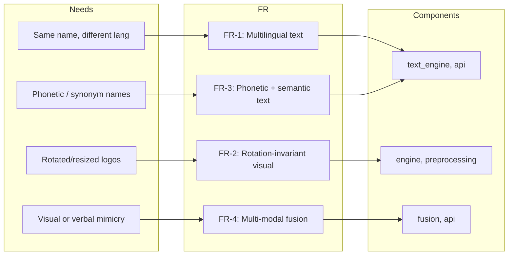

# Business Requirements Document (BRD)
## AI-Driven Trademark Infringement Detection Framework

**Document version:** 1.0  
**Last updated:** [Date]

---

## 1. Executive Summary

### Problem
IP bodies are seeing a sharp rise in trademark infringement cases. One reason is the spread of AI tools that make it easy to generate images, create content, and copy brands. Manual checks no longer scale, and results vary too much.

### Objective
We want to deliver a **solution that can scale and uses AI** to spot possible infringements up front—so an IP department can cut litigation risk, improve compliance, and protect its portfolio. The solution uses **ML and AI across the board**: computer vision (logo and image similarity), NLP (multilingual text and brand matching), and fusion of several modalities. That fits an AI Applied Project.

### Scope and Deliverables
- **In scope:** We design and build a detection framework that handles (1) same or similar names in different languages, (2) reuse of trademarked images with different orientation or aspect, (3) synonyms or soundalike brand names, and (4) visual or verbal copycatting that could confuse consumers.
- **Deliverables:** This BRD (functional and technical requirements), a high-level architecture that includes AI components, a working prototype (backend API and frontend), and docs for governance and future scale-up.

### Dataset and Performance (Current Prototype)
- The system is **trained and indexed on 500 trademark images** from the client. All similarity logic and weightages are tuned to this set.
- **Latency:** Similarity-check response time is **on par with or better than** the Singapore IPOS Similar Mark Search portal, even though we run on **limited resources** (personal machines and free or low-cost servers). So the architecture is efficient and ready to scale when we have proper infrastructure.

---

## 2. Stakeholder Requirements

We map stakeholder needs from the project brief to concrete requirements as follows.

| Need | Requirement ID | Requirement description |
|------|----------------|-------------------------|
| Identical names in different languages | FR-1 | The system shall support **multilingual text extraction and cross-language brand matching** (e.g. Hindi/Devanagari and English), including OCR, transliteration, translation, and semantic/phonetic similarity. |
| Replication of images with modified orientation/aspect | FR-2 | The system shall provide **rotation- and aspect-invariant visual similarity** via robust image embeddings (e.g. vision transformers, CNNs) and test-time augmentation (TTA) so that rotated or resized logos are still matched. |
| Synonyms or phonetically similar brand names | FR-3 | The system shall support **phonetic and semantic text similarity** (e.g. Soundex/Metaphone, multilingual sentence embeddings) so that synonyms and phonetically similar names are detected. |
| Visual or verbal mimicry causing consumer confusion | FR-4 | The system shall combine **multiple modalities** (visual embeddings, text, color, font, shape) in a single similarity score with **adaptive weighting and re-ranking** so that both visual and verbal mimicry are considered. |

---

## 3. Functional Requirements (FR)

| ID | Requirement | Traceability (e.g. API / component) |
|----|-------------|-------------------------------------|
| FR-1 | Multilingual text and cross-language brand matching | `text_engine.py`: PaddleOCR, EasyOCR, transliteration, translation, semantic + phonetic similarity; `api.py`: text score in similarity-check. |
| FR-2 | Rotation-invariant visual similarity | `engine.py`: DINOv2, VGG16; `api.py`: TTA variants (0°, 180°); `preprocessing.py`: rembg, pad-and-resize. |
| FR-3 | Phonetic and semantic text similarity | `text_engine.py`: sentence-transformers, jellyfish (Soundex/Metaphone), hybrid word similarity, stop-word and brand-match logic. |
| FR-4 | Multi-modal fusion and re-ranking | `fusion.py`: adaptive weights, RRF, z-score normalization; `api.py`: CandidateScores, rerank; modalities: DINO, VGG, text, color, font, shape. |
| FR-5 | Logo/image upload for similarity check | `POST /similarity-check`: accepts image file; returns top-K similar trademarks with per-modality scores. |
| FR-6 | Logo submission for repository indexing | `POST /submit-logo`: accepts image file; extracts all features and inserts into Milvus. |
| FR-7 | Batch repository indexing | `index_repo.py`: scans repository_images, extracts features, inserts into Milvus (batch); supports skip-if-exists. |
| FR-8 | Optional email notifications | `POST /send-email`: accepts receiver email, subject, HTML body; sends via Resend API. |
| FR-9 | Health/readiness check | `GET /`: returns service status and version. |

---

## 4. Non-Functional Requirements (NFR)

| ID | Category | Requirement |
|----|----------|-------------|
| NFR-1 | Performance | Similarity-check should feel responsive (e.g. under ~15–30 seconds per query depending on hardware); batch indexing supports a configurable batch size (e.g. 50 images). |
| NFR-2 | Scalability | We use a vector DB (Milvus) with indexed fields for DINO, VGG, text, color, font, shape, icon; the collection should hold at least thousands of trademark images. |
| NFR-3 | Security | No API keys or secrets in code; things like the Resend API key go in environment variables; CORS is configurable for the frontend. |
| NFR-4 | Maintainability | Code is split into modules (engine, text_engine, color_engine, shape_engine, fusion, preprocessing, api); dependencies are pinned in requirements.txt. |

---

## 5. Technical Requirements / Solution Overview

### High-level stack
- **Backend:** Python 3.10, FastAPI, Uvicorn.
- **Vector DB:** Milvus (Lite), single collection with multiple vector and scalar fields.
- **ML/AI:** PyTorch, Transformers (DINOv2), TorchVision (VGG16), PaddleOCR, EasyOCR, sentence-transformers, rembg (U2-Net), scikit-learn, scikit-image, OpenCV, imagehash, jellyfish, indic-transliteration, deep-translator, pyemd.
- **Email:** Resend API (HTTP); sender configurable (e.g. onboarding@resend.dev or custom domain).
- **Frontend:** React, Vite, TypeScript, shadcn-ui, Tailwind (Lovable); communicates with backend API.
- **Deployment:** Docker; optional cloud deployment (e.g. AWS EC2).

### AI/ML building blocks
- **Vision:** DINOv2 (self-supervised vision transformer for logo embeddings), VGG16 (CNN for extra visual signal), U2-Net via rembg (background removal), TTA for rotation invariance, icon embedding, shape (Hu moments, contour histograms), and pHash for retrieval.
- **NLP / text:** PaddleOCR and EasyOCR (multilingual OCR), sentence-transformers (text embeddings), phonetic matching (Soundex/Metaphone), transliteration (Devanagari→Latin), and machine translation (Hindi/Marathi→English).
- **Fusion and ranking:** Z-score normalization, Reciprocal Rank Fusion (RRF), adaptive weights per modality, brand-match overrides (perfect and soft text), and pHash near-duplicate short-circuit.

The **high-level solution architecture** (system context, data flows, and placement of AI components) is described and illustrated in the accompanying Project Report.

**Stakeholder need → requirement → component (traceability)**

### Scores Computed per Image and Weightages
For each query–candidate pair the system computes **six modality scores** that are combined into a single final score:

| # | Score | How it is computed | Weight (both have text) | Weight (one has text) | Weight (neither has text) |
|---|--------|---------------------|--------------------------|------------------------|----------------------------|
| 1 | **DINO** | Vision transformer (DINOv2) embedding; max cosine over TTA variants (0°, 180°); boosted by icon similarity when applicable. | 0.20 | 0.25 | 0.35 |
| 2 | **VGG** | CNN (VGG16) embedding; max cosine over TTA variants. | 0.05 | 0.10 | 0.10 |
| 3 | **Text** | See below (translation, transliteration, phonetic, semantic, edit, stop words, brand boost). | 0.25 | 0.15 | 0.00 |
| 4 | **Color** | Earth Mover’s Distance on CIELAB palettes (5 colours); score = 1 − EMD/τ. | 0.10 | 0.15 | 0.20 |
| 5 | **Font** | DINOv2 embedding on cropped text regions; cosine similarity. | 0.20 | 0.10 | 0.00 |
| 6 | **Shape** | Hu moments (7-dim) cosine similarity. | 0.20 | 0.25 | 0.35 |

**How we get the single text score (0–1):**
- **OCR:** We run multilingual OCR (PaddleOCR, EasyOCR) on the query and stored image.
- **Transliteration:** Devanagari (and other Indic scripts) → Latin (e.g. IAST) so we can compare across scripts.
- **Translation:** Hindi/Marathi → English (Google Translate API) when we need semantic alignment.
- **Per-word similarity:** For each query–repo word pair we use **edit distance** (Levenshtein), **semantic similarity** (sentence-transformer; 0.6 weight same-script, we skip it cross-script), and **phonetic similarity** (Soundex/Metaphone via jellyfish) as a bounded boost (+0.10–0.15) on top of edit so phonetic doesn’t dominate and cause false matches.
- **Stop-word filtering:** We drop common words (“the”, “of”, “ltd”, “pvt”) and very short tokens.
- **Brand boost:** If any non–stop-word pair has similarity ≥ 0.95, we floor the overall text score at 0.9.
- **Aggregation:** Symmetric mean (half query→repo, half repo→query) over best-match scores.

**Fusion:** We z-score normalise the six scores, then combine them with **adaptive weights** (from the table above, depending on text presence) and **RRF** with a blend (λ = 0.5) of RRF and weighted z-scores. **pHash** and **icon** act as boosts: a pHash near-duplicate can short-circuit to a very high final score; icon similarity can boost DINO.

---

## 6. Assumptions and Constraints

### Assumptions
- Repository images sit in a known folder (`repository_images`) and we can batch-process them offline.
- We support PNG and JPEG/JPG.
- We care mainly about English, Hindi (Devanagari), and Marathi; OCR and translation are set up for these.
- Email is sent via a third party (Resend); whoever deploys is responsible for deliverability and domain verification.
- Users hitting the similarity-check UI can reach the backend (same host or CORS set up).

### Constraints
- Real-time video or live camera is out of scope.
- The system is built for logo/trademark still images, not general scene understanding.
- The Milvus collection schema (e.g. trademark_v18) is fixed per deployment; changing it means migration or re-indexing.

---

*End of BRD. For architecture diagrams and the full implementation story, see the Project Report.*
