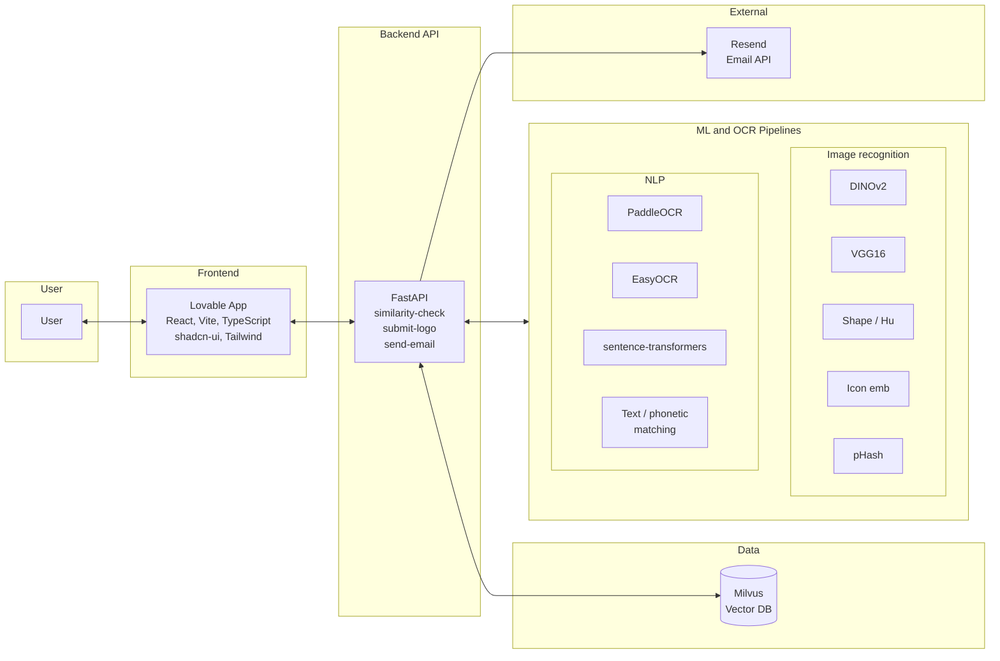
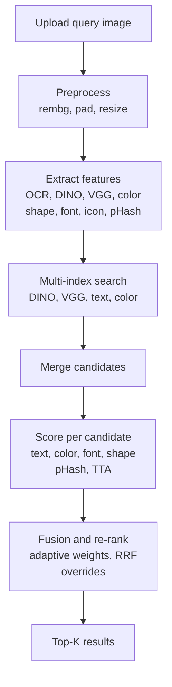

# AI-Driven Trademark Infringement Detection Framework
## Project Report

**Course:** AI Applied Project  
**Type:** Live Project  

**Team:** [Team name]  
**Institution:** [Institution]  
**Date:** [Date]

---

## Table of Contents

1. [Introduction](#1-introduction)
2. [Current State and Benchmark](#2-current-state-and-benchmark)
3. [Solution Architecture](#3-solution-architecture)
4. [Working Prototype](#4-working-prototype)
5. [Implementation](#5-implementation)
6. [Results and Demo](#6-results-and-demo)
7. [5-Year Roadmap and Business Case](#7-5-year-roadmap-and-business-case)
8. [Governance and Project Management](#8-governance-and-project-management)
9. [Limitations and Future Work](#9-limitations-and-future-work)
10. [Conclusion](#10-conclusion)
11. [References and Appendices](#11-references-and-appendices)

---

## 1. Introduction

This report documents a **Live Project** undertaken as part of the **AI Applied Project** course. The project addresses a real-world problem: government intellectual property (IP) management departments are facing a surge in trademark infringement litigations, partly driven by AI-powered tools that enable effortless image generation, content creation, and brand mimicry.

### 1.1 Problem Statement

The organization responsible for managing intellectual property rights needs an **AI-based detection system** capable of identifying infringement risks across diverse scenarios, including:

- Identical or similar names used in different languages (e.g. English and Hindi).
- Replication of trademarked images with modified orientation or aspect ratios.
- Use of synonyms or phonetically similar brand names.
- Visual or verbal mimicry that may cause consumer confusion.

### 1.2 Objective

To design and implement a **scalable, AI-enabled solution** that proactively detects potential trademark infringements, helping reduce litigation risk, enhance compliance, and protect the IP portfolio—while balancing innovation with legal and operational safeguards.

### 1.3 Scope

- **In scope:** A detection framework that combines **image recognition** (computer vision) and **NLP** (multilingual text and semantic/phonetic matching) with a working prototype consisting of a backend API and a web-based interface. The solution uses **ML and AI wherever possible** across the pipeline.
- **Out of scope:** Real-time video, generic scene understanding, and full-scale production deployment (addressed in the 5-year roadmap).

---

## 2. Current State and Benchmark

### 2.1 Problem in Hand

Government IP departments face:

- **Rising litigation:** A surge in trademark infringement cases linked to digital content and AI-generated or -assisted mimicry.
- **Diverse infringement patterns:** Identical names in different languages, copied or rotated logos, phonetic and semantic variations, and combined visual/verbal mimicry.
- **Need for proactive detection:** Moving from reactive enforcement to proactive risk detection across applications and digital channels.

### 2.2 Current Issues

The status quo is characterised by:

- **Volume:** Large numbers of applications and digital assets make manual review unsustainable.
- **Manual bottlenecks:** Examiners rely on keyword search and visual inspection, leading to delays and inconsistency.
- **Lack of scalable similarity search:** Limited or no image-based similarity and cross-lingual text matching.
- **Difficulty in cross-language and visual similarity:** Manual comparison of scripts (e.g. Devanagari vs Latin) and rotated or resized logos is time-consuming and error-prone.

### 2.3 Current Manual Process (Minimal / No Tech Enablement)

In many government IP workflows today:

- **Keyword and text search** are the primary tools; examiners type terms and review lists manually.
- **Visual inspection** is done by eye—comparing logos and marks one by one.
- **Filing-based workflows** dominate; each application is processed with limited linkage to a unified similarity engine.
- **Image similarity tools** are often absent or rudimentary, so rotation, aspect ratio, and minor edits are hard to detect at scale.

This leads to **high man hours per application**, inconsistent outcomes, and a higher risk of missed similarities or delayed detection of infringement.

### 2.4 Benchmark: Singapore IPOS Trademark Portal

As a reference for tech-enabled similar-mark search in government IP, we use the **Singapore IPOS Trademark Portal**, in particular the **Similar Mark Search** service:

- **Link:** [IPOS – Similar Mark Search](https://digitalhub.ipos.gov.sg/FAMN/eservice/IP4SG/MN_TmSimilarMarkSearch)

Singapore’s portal provides a government-grade, self-service interface for searching similar marks. Our solution **compares and complements** this by:

- Integrating **AI-driven image recognition** (e.g. DINOv2, VGG) and **NLP** (multilingual OCR, semantic and phonetic text similarity) into a single pipeline.
- Supporting **multi-modal fusion** (visual + text + color + font + shape) and **Indian languages** (e.g. Hindi, Marathi) with transliteration and translation.
- Offering a **working prototype** that can be extended toward a 5-year roadmap for full-scale implementation.

---

## 3. Solution Architecture

### 3.1 High-Level Architecture Integrating AI Components

The system is built around a **backend API** that orchestrates **image recognition** (computer vision) and **NLP** (text extraction and similarity) and stores multi-modal embeddings in a **vector database**. The **frontend** provides the user interface; **Resend** is used for optional email notifications.

**Figure 1** below shows the high-level system architecture. AI/ML components are explicitly grouped into **Image recognition** (DINO, VGG, shape, icon, pHash) and **NLP** (PaddleOCR, EasyOCR, sentence-transformers, text/phonetic matching).

### 3.2 Narrative: How Image Recognition and NLP Are Integrated

- **Image recognition:** Incoming query images are preprocessed (background removal via U2-Net/rembg, padding, resize). DINOv2 and VGG16 produce visual embeddings; shape features (Hu moments, contour histograms) and perceptual hash (pHash) support rotation-invariant and near-duplicate detection. An **icon embedding** (logo with text regions masked) adds a symbol-focused signal. Test-time augmentation (TTA) with rotations improves robustness.
- **NLP:** Multilingual OCR (PaddleOCR and EasyOCR) extracts text from the same image (and variants). Devanagari is transliterated to Latin and optionally translated to English. Sentence-transformers provide semantic embeddings; phonetic algorithms (Soundex, Metaphone) and edit distance support brand-name and phonetic similarity. Stop-word filtering and brand-match overrides reduce noise and boost true brand matches.
- **Multi-index retrieval and fusion:** The backend runs **parallel searches** on Milvus (DINO, VGG, text, color) and merges candidates. Per-candidate scores for text, color, font, and shape are computed; **adaptive weights** (depending on whether query and candidate have text) and **Reciprocal Rank Fusion (RRF)** with z-score normalization produce a single ranking. pHash near-duplicates and strong text matches receive short-circuit or override treatment.

---

## 4. Working Prototype

### 4.1 Detection Logic

The similarity-check pipeline is as follows:

1. **Upload query image** to the API.
2. **Preprocess:** Background removal (rembg), pad to square, resize (e.g. 224×224).
3. **Extract features:** OCR (parallel Paddle + Easy), visual embeddings (DINO, VGG) for main and icon images, color histogram and palette, shape (Hu, contour histogram), font embedding (DINO on text crops), pHash.
4. **Multi-index search:** Query DINO, VGG, text, and color indices in Milvus (in parallel); merge candidate IDs.
5. **Merge candidates** and load full records from Milvus.
6. **Score each candidate:** DINO and VGG with TTA (max over variants), icon similarity, text score (hybrid word similarity), color (EMD on palette), font (cosine), shape (cosine on Hu). Apply pHash boost where applicable.
7. **Fusion and re-rank:** Adaptive weights, z-score normalization, RRF; apply perfect-text and soft-text overrides; sort by final score.
8. **Return top-K results** (e.g. top 20) with per-modality scores.

**Figure 2** illustrates this flow.

### 4.2 Interface

- **Frontend:** The [trademark-ing](https://github.com/shlsheth263/trademark-ing) repository provides a Lovable-built web app (React, Vite, TypeScript, shadcn-ui, Tailwind). Users can upload a logo image, optionally enter text, run a similarity check, and view a results table with thumbnail, trademark ID, final score, and per-modality scores (DINO, VGG, text, color, font, shape).
- **Backend API endpoints:**
  - `GET /` — Health check.
  - `POST /similarity-check` — Upload image; returns query OCR, top-K similar trademarks with scores.
  - `POST /submit-logo` — Upload image; indexes it into the Milvus repository.
  - `POST /send-email` — Send an HTML email (receiver, subject, body) via Resend.

*[Insert screenshot of UI here: upload screen and results table.]*  
*[Optional: insert sample API response JSON.]*

---

## 5. Implementation

### 5.1 Tools and Technologies

| Category | Tools / technologies |
|----------|----------------------|
| **Development** | Cursor (AI-assisted IDE), Git, GitHub, Docker |
| **Frontend** | Lovable, React, Vite, TypeScript, shadcn-ui, Tailwind CSS, Supabase (if used) |
| **Backend** | Python 3.10, FastAPI, Uvicorn |
| **Vector DB** | Milvus (Lite) |
| **ML/AI** | PyTorch, Transformers (DINOv2), TorchVision (VGG16), PaddleOCR, EasyOCR, sentence-transformers, rembg (U2-Net), scikit-learn, scikit-image, OpenCV, imagehash, jellyfish, indic-transliteration, deep-translator, pyemd |

### 5.2 Backend Stack (Summary)

- **Core:** FastAPI, PyTorch 2.2, Transformers, TorchVision, Pillow, NumPy.
- **OCR & NLP:** PaddlePaddle, PaddleOCR, EasyOCR, sentence-transformers, python-Levenshtein, jellyfish, indic-transliteration, deep-translator.
- **Vision & preprocessing:** rembg, onnxruntime, opencv-python-headless, scikit-image, imagehash.
- **Color & shape:** scikit-learn, pyemd, scipy.
- **Data & API:** pymilvus, pydantic, python-multipart, requests (for Resend).

### 5.3 Frontend

The frontend is hosted in the public repository [shlsheth263/trademark-ing](https://github.com/shlsheth263/trademark-ing). It is built with **Lovable** and uses **React**, **Vite**, **TypeScript**, **shadcn-ui**, and **Tailwind CSS**. It calls the backend API for similarity-check and displays results in a sortable table with thumbnails and per-modality scores.

### 5.4 Deployment

- **Container:** Dockerfile defines a Python 3.10 slim image with system dependencies for OpenCV and PaddleOCR; app runs with `uvicorn api:app --host 0.0.0.0 --port 8000`.
- **Configuration:** Sensitive configuration (e.g. `RESEND_API_KEY`) is supplied via environment variables; no secrets in code.
- **Optional:** Backend can be deployed on cloud (e.g. AWS EC2); Milvus DB file is persisted on a volume or host path.

### 5.5 ML and AI Components Used (Where We Use ML/AI)

The following list showcases **every place ML and AI are applied** in the solution:

| Area | Component | Role |
|------|-----------|------|
| **Computer vision / deep learning** | DINOv2 | Self-supervised vision transformer for logo embeddings (768-dim). |
| | VGG16 | CNN for complementary visual features (4096-dim). |
| | U2-Net (rembg) | Deep learning model for background removal. |
| | TTA | Test-time augmentation (0°, 180°) for rotation-invariant matching. |
| | Icon embedding | DINO on text-masked image for symbol-focused similarity. |
| **NLP / text AI** | PaddleOCR | Deep learning–based multilingual OCR (en, hi, mr). |
| | EasyOCR | Deep learning–based OCR (hi, mr, en). |
| | sentence-transformers | Multilingual text embeddings for semantic similarity. |
| | Phonetic matching | Soundex and Metaphone (jellyfish) for brand-name variants. |
| | Transliteration | Devanagari → Latin (indic-transliteration). |
| | Machine translation | Hindi/Marathi → English (deep-translator / Google Translate). |
| **ML-based fusion and ranking** | Z-score normalization | Normalise per-modality scores before fusion. |
| | Reciprocal Rank Fusion (RRF) | Combine rankings from multiple modalities. |
| | Adaptive weighting | Different weight profiles when both have text, one has text, or neither. |
| | Brand-match overrides | Perfect text match → 100% final; soft text override when text ≥ 0.85. |
| | pHash short-circuit | Near-duplicate detection bypasses full scoring when pHash very high. |
| **Supporting methods (alongside AI)** | K-means | Color palette extraction in CIELAB. |
| | Earth Mover’s Distance | Perceptual color similarity between palettes. |
| | Hu moments + contour histograms | Shape descriptors supporting retrieval. |
| | Perceptual hashing (pHash) | Fast near-duplicate detection. |

---

## 6. Results and Demo

### 6.1 Modalities and API Endpoints (Tables)

**Table: Modalities and AI/ML type**

| Modality | Description | AI/ML type |
|----------|-------------|------------|
| DINO | Vision transformer embedding | Deep learning |
| VGG | CNN embedding | Deep learning |
| Text | OCR + semantic + phonetic similarity | NLP + DL |
| Color | Palette + EMD | Classical ML (K-means) + metric |
| Font | DINO on text crops | Deep learning |
| Shape | Hu moments, contour histogram | Signal processing + heuristic |
| Icon | DINO on icon region | Deep learning |
| pHash | Perceptual hash | Heuristic (supporting retrieval) |
| TTA | Rotation variants | Data augmentation |

**Table: API endpoints**

| Method | Endpoint | Purpose |
|--------|----------|---------|
| GET | `/` | Health check |
| POST | `/similarity-check` | Upload image; return top-K similar trademarks |
| POST | `/submit-logo` | Upload image; index into repository |
| POST | `/send-email` | Send HTML email via Resend |

### 6.2 Example Use Case

- **Query:** A logo image containing “Amul” in Hindi (Devanagari) and “Bharat ka Swaad.”
- **Expected:** The English “Amul” logo (same brand) should appear in the top results with high text and visual scores.
- **Mechanism:** OCR extracts and transliterates/translates text; “amul” is matched across scripts; brand-match and soft-text overrides boost the score; DINO/VGG and icon similarity add visual evidence.

*[Insert screenshot of results table for this or another example.]*

---

## 7. 5-Year Roadmap and Business Case

### 7.1 Five-Year Roadmap for Full-Scale Implementation

| Phase | Timeline | Milestones |
|-------|----------|------------|
| **Year 1** | Pilot | Deploy prototype in one office or for one trademark class; collect feedback; tune thresholds and weights. |
| **Year 2** | Scale repository and users | Expand image repository; onboard more examiners; integrate with internal user directory if needed. |
| **Year 3** | Workflow integration | Integrate with existing IP filing and examination workflows; audit logging and compliance reporting. |
| **Year 4** | Languages and dispute support | Add more Indian languages and scripts; optional module for opposition/dispute support. |
| **Year 5** | Analytics and policy | Dashboards and analytics on similarity trends; input to policy and risk assessment. |

### 7.2 Cost–Benefit Analysis

- **Costs:** Development (sunk for the prototype); ongoing: infrastructure (servers/cloud), support and maintenance, training, Resend or email service; optional: domain verification and dedicated sender for email.
- **Benefits:** Reduced man hours per application (examiners get a ranked shortlist instead of blind search); faster examination; fewer missed similarities; more consistent decisions; audit trail of similarity scores and modalities.

*If data is available, add rough quantitative estimates (e.g. hours saved per 1,000 applications).*

### 7.3 Risk Mitigation Strategy

| Risk | Mitigation |
|------|------------|
| False positives/negatives | Human-in-the-loop: examiners review top-K; thresholds and weights tuned in pilot; benchmark against Singapore and internal cases. |
| Adoption | Training and change management; phased rollout; clear documentation and support. |
| Data quality | Curated repository; periodic re-indexing; OCR and embedding quality checks. |
| Vendor lock-in | Prefer open models (DINOv2, VGG) and standard APIs; abstract email and optional services behind config. |
| Regulatory | Compliance with data and privacy policies; audit logs; alignment with IP office guidelines. |

---

## 8. Governance and Project Management

- **Milestones:** Project followed a phased approach: requirements and BRD, architecture and design, backend implementation (engine, text, color, shape, fusion), API and indexing, frontend integration, email and deployment.
- **Stakeholder communication:** Regular alignment with course and project expectations; use of version control (Git/GitHub) and documentation (BRD, report).
- **Version control:** Backend and frontend in separate repositories; dependencies and deployment captured in requirements.txt and Dockerfile.

---

## 9. Limitations and Future Work

- **Email:** Production email depends on Resend (or similar) and domain verification; default sender (e.g. onboarding@resend.dev) is for testing only.
- **Languages:** Current focus is English, Hindi, and Marathi; extension to more scripts and languages is planned in the roadmap.
- **Explainability:** Scores are interpretable per modality, but no formal explainability (e.g. saliency maps) is implemented yet.
- **Scale:** Milvus Lite is file-based; very large portfolios may require Milvus cluster or another vector DB for distributed search.

---

## 10. Conclusion

This report described the **problem in hand** (surge in trademark infringement, need for AI-based detection), the **current manual process** (minimal tech, high man hours), and the **benchmark** (Singapore IPOS Similar Mark Search). It presented a **high-level solution architecture** that integrates **image recognition** (DINO, VGG, shape, icon, pHash) and **NLP** (OCR, transliteration, translation, semantic and phonetic matching), and documented a **working prototype** (detection logic and interface) built with **ML and AI throughout**. A **5-year roadmap** and **business case** (cost–benefit and risk mitigation) were outlined for full-scale implementation. The project demonstrates the use of ML and AI in an **AI Applied Project** Live Project context.

---

## 11. References and Appendices

- Project description (AI-Driven Trademark Infringement Detection Framework for Government IP Management).
- Singapore IPOS Trademark Portal – Similar Mark Search: https://digitalhub.ipos.gov.sg/FAMN/eservice/IP4SG/MN_TmSimilarMarkSearch
- DINOv2: https://github.com/facebookresearch/dinov2
- PaddleOCR: https://github.com/PaddlePaddle/PaddleOCR
- EasyOCR: https://github.com/JaidedAI/EasyOCR
- Milvus: https://milvus.io/
- Resend: https://resend.com/
- Cursor: https://cursor.com/
- Lovable: https://lovable.dev/
- Frontend repository: https://github.com/shlsheth263/trademark-ing

---

*End of Project Report.*
