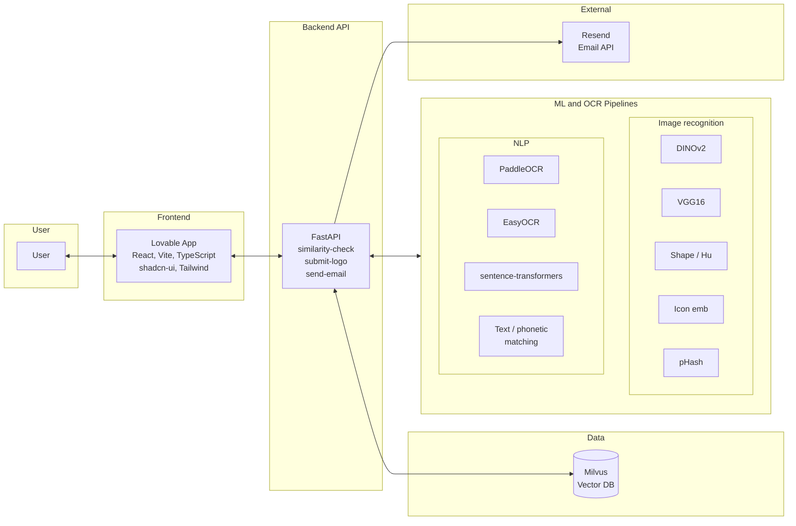
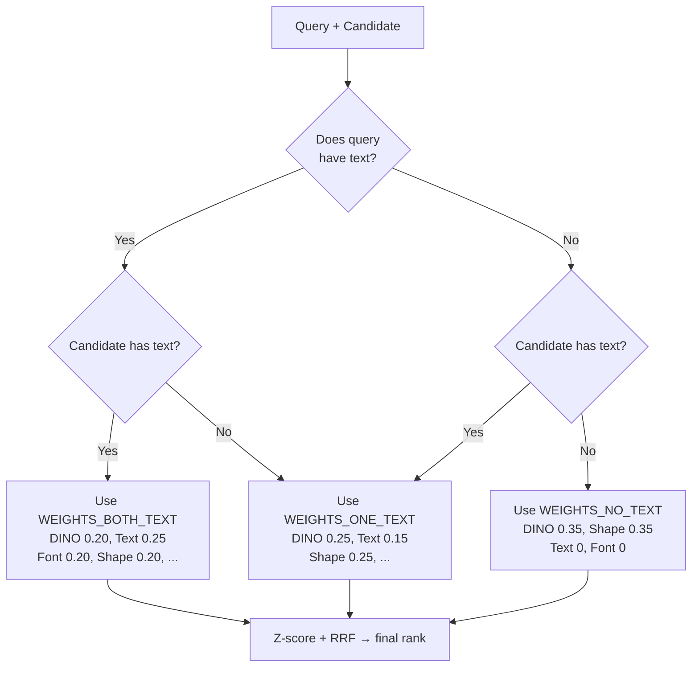
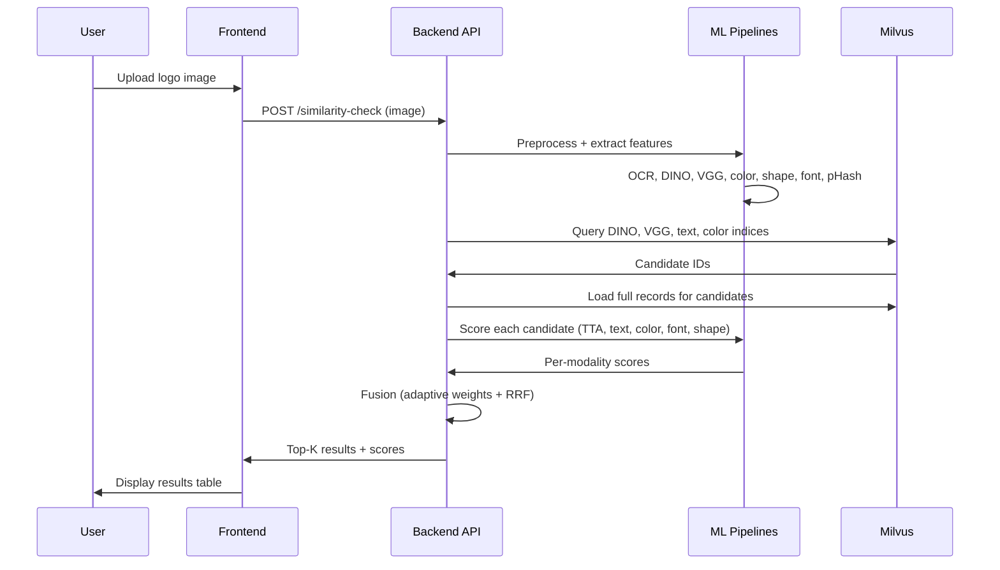
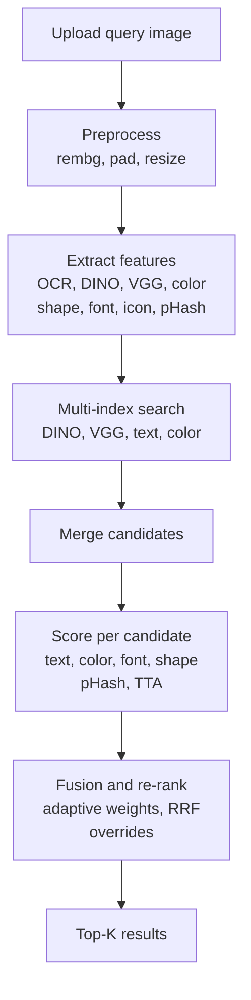
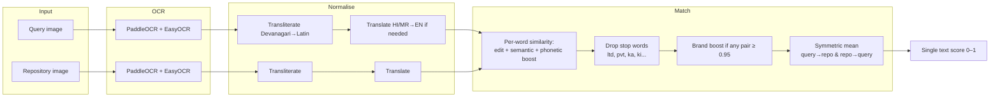
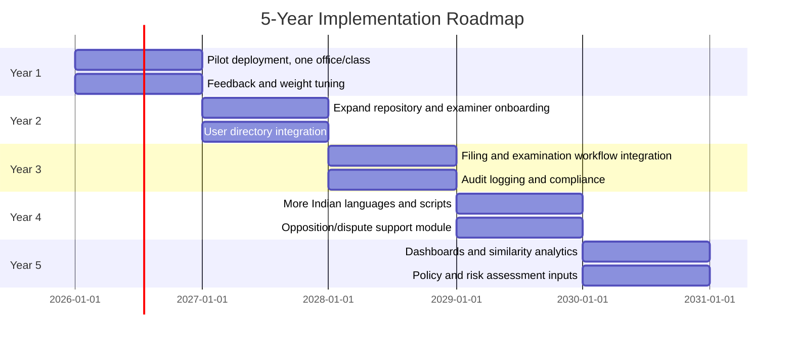

# AI-Driven Trademark Infringement Detection Framework
## Project Report

**Course:** AI Applied Project  
**Type:** Live Project  

**Team:** [Team name]  
**Institution:** [Institution]  
**Date:** [Date]

---

## Table of Contents

1. [Introduction](#1-introduction)
2. [Current State and Benchmark](#2-current-state-and-benchmark)
3. [Solution Architecture](#3-solution-architecture)
4. [Working Prototype](#4-working-prototype)
5. [Implementation](#5-implementation)
6. [Results and Demo](#6-results-and-demo)
7. [5-Year Roadmap and Business Case](#7-5-year-roadmap-and-business-case)
8. [Governance and Project Management](#8-governance-and-project-management)
9. [Limitations and Future Work](#9-limitations-and-future-work)
10. [Conclusion](#10-conclusion)
11. [References and Appendices](#11-references-and-appendices)

**Figures:** 1 – System architecture | 1b – Fusion weight selection | 1c – Similarity-check sequence | 2 – Detection pipeline | 3 – Text score pipeline | 4 – 5-year roadmap timeline

---

## 1. Introduction

This report documents a **Live Project** delivered as part of the **AI Applied Project** course. The work addresses a real-world need: government bodies that manage intellectual property (IP) are facing a sharp rise in trademark infringement cases. One driver is the widespread use of AI-powered tools that make it easy to generate lookalike logos, copy brand names across languages, and create content that blurs the line between inspiration and infringement. Manual checks no longer scale, and outcomes vary too much across examiners and offices.

Our goal was to design and build an **AI-driven trademark infringement detection framework** that combines **computer vision** (logo and image similarity) with **natural language processing** (multilingual text extraction, transliteration, translation, and semantic and phonetic matching). The deliverable is a **working prototype**: a backend API and a web interface that let users upload a logo or trademark image and receive a ranked list of similar marks from a repository, with per-modality scores and a single fused similarity score. The system is currently trained and indexed on **500 trademark images** provided by the client, and its similarity-check latency is **comparable to or better than** the Singapore IPOS Similar Mark Search portal despite running on limited resources (personal devices and free-tier servers). This report describes the problem in hand, the current manual process and benchmark, the solution architecture and detection logic, the implementation and where ML/AI are used, results and score weightages, and a 5-year roadmap for full-scale deployment.

### 1.1 Problem Statement

IP bodies need a system that **can spot** infringement risks in a variety of situations:

- Same or similar names in different languages (e.g. English and Hindi).
- Trademarked images that have been flipped, rotated, or resized.
- Synonyms or names that sound alike (phonetic lookalikes).
- Visual or verbal copycatting that could confuse consumers.

### 1.2 Objective

We set out to build an **AI-backed solution** that can scale and that **detects possible infringements up front**—cutting litigation risk, improving compliance, and protecting the IP portfolio without blocking innovation or ignoring legal and operational constraints.

### 1.3 Scope

- **In scope:** A detection framework that **combines** image recognition (computer vision) and NLP (multilingual text plus semantic and phonetic matching), with a working prototype: backend API and web UI. We use **ML and AI across the pipeline** wherever it fits.
- **Out of scope:** Real-time video, general scene understanding, and full production rollout—those are covered in the 5-year roadmap.

### 1.4 Dataset and Deployment Context

- The prototype is **trained and indexed on 500 trademark images** supplied by the client. All similarity logic, weightages, and fusion are tuned to this set.
- We run it on **limited hardware** (personal machines and free or cheap servers). Even so, **similarity-check latency matches or beats** the Singapore IPOS Similar Mark Search portal, so the design holds up and is ready to scale when proper infrastructure is available.

---

## 2. Current State and Benchmark

### 2.1 Problem in Hand

IP departments are dealing with:

- **More litigation:** Infringement cases are up, tied to digital content and AI-assisted copying.
- **Mixed types of infringement:** Same name in another language, copied or rotated logos, soundalike or synonym names, and combinations of visual and verbal mimicry.
- **Pressure to detect early:** Moving from “react when someone complains” to spotting risk across applications and channels before it escalates.

### 2.2 Current Issues

How things work today:

- **Volume:** Too many applications and assets for manual review to be feasible.
- **Bottlenecks:** Examiners depend on keyword search and eyeballing logos, which slows things down and leads to uneven results.
- **No real image similarity:** Little or no image-based similarity search or cross-lingual text matching.
- **Cross-language and visual comparison is hard:** Comparing Devanagari with Latin, or catching rotated or resized logos, is slow and error-prone when done by hand.

### 2.3 Current Manual Process (Minimal / No Tech Enablement)

In many IP offices today:

- **Keyword and text search** do most of the work; examiners type in terms and go through lists by hand.
- **Visual check** is manual—logos and marks are compared one by one.
- **Filing-centric workflows** mean each application is handled on its own, with weak links to any shared similarity engine.
- **Image similarity** is missing or basic, so rotation, aspect changes, and small edits are hard to catch at scale.

The result: **lots of hours per application**, inconsistent decisions, and a real chance of missing similarities or catching infringement too late.

### 2.4 Benchmark: Singapore IPOS Trademark Portal

We use the **Singapore IPOS Trademark Portal**—especially its **Similar Mark Search**—as a reference for what a tech-enabled, government similar-mark search can look like:

- **Link:** [IPOS – Similar Mark Search](https://digitalhub.ipos.gov.sg/FAMN/eservice/IP4SG/MN_TmSimilarMarkSearch)

Singapore’s portal is a solid, self-service way to search similar marks. Our solution **sits alongside it** by:

- **Bringing together** AI-based image recognition (DINOv2, VGG) and NLP (multilingual OCR, semantic and phonetic text similarity) in one pipeline.
- **Adding** multi-modal fusion (visual, text, color, font, shape) and **Indian languages** (Hindi, Marathi) with transliteration and translation.
- **Delivering** a working prototype that can grow into the 5-year roadmap.

**Performance:** We run on limited resources (personal machines and free-tier servers), but **similarity-response latency is on par with or better than** the Singapore portal. So the design is efficient enough to move to production once we have the right infrastructure.

---

## 3. Solution Architecture

### 3.1 High-Level Architecture Integrating AI Components

At the centre we have a **backend API** that runs **image recognition** (computer vision) and **NLP** (text extraction and similarity) and writes multi-modal embeddings into a **vector database**. The **frontend** is the user interface; we use **Resend** for optional email notifications.

**Figure 1** below shows the high-level system architecture. AI/ML components are explicitly grouped into **Image recognition** (DINO, VGG, shape, icon, pHash) and **NLP** (PaddleOCR, EasyOCR, sentence-transformers, text/phonetic matching).

### 3.2 How Image Recognition and NLP Fit Together

- **Image side:** Query images go through preprocessing (background removal with U2-Net/rembg, padding, resize). DINOv2 and VGG16 give us visual embeddings; we also use shape (Hu moments, contour histograms) and perceptual hash (pHash) for rotation-invariant and near-duplicate detection. An **icon embedding** (logo with text areas masked) adds a symbol-only signal. We use test-time augmentation (TTA) with rotations to improve robustness.
- **Text side:** Multilingual OCR (PaddleOCR and EasyOCR) pulls text from the image and its variants. Devanagari is transliterated to Latin and, when needed, translated to English. Sentence-transformers give semantic embeddings; we use Soundex, Metaphone, and edit distance for brand-name and phonetic similarity. Stop-word filtering and brand-match overrides cut noise and push real brand matches up.
- **Retrieval and fusion:** The backend **queries Milvus in parallel** (DINO, VGG, text, color) and merges candidate sets. We score each candidate on text, color, font, and shape, then apply **adaptive weights** (based on whether query and candidate have text) and **Reciprocal Rank Fusion (RRF)** with z-score normalization to get one ranking. pHash near-duplicates and strong text matches get short-circuit or override treatment.

**Figure 1b – How we pick fusion weights**

We choose one of three weight profiles depending on whether the query and the candidate image contain text. The flowchart below captures that logic.

**Figure 1c – End-to-end request flow (similarity check)**

From the moment a user uploads an image to the moment they see ranked results, the following path is taken.

---

## 4. Working Prototype

### 4.1 Detection Logic

What happens when you run a similarity check:

1. **Upload** the query image to the API.
2. **Preprocess:** Remove background (rembg), pad to square, resize (e.g. 224×224).
3. **Extract features:** OCR (Paddle + Easy in parallel), visual embeddings (DINO, VGG) for the full image and the icon crop, color palette, shape (Hu, contour histogram), font embedding (DINO on text crops), pHash.
4. **Search:** Hit DINO, VGG, text, and color indices in Milvus in parallel and merge the candidate IDs.
5. **Load** full records for those candidates from Milvus.
6. **Score each candidate:** DINO and VGG with TTA (take max over variants), icon similarity, text score (hybrid word similarity), color (EMD on palette), font (cosine), shape (cosine on Hu). Add pHash boost when it applies.
7. **Fusion and re-rank:** Apply adaptive weights, z-score normalization, and RRF; apply perfect-text and soft-text overrides; sort by final score.
8. **Return** top-K (e.g. top 20) with per-modality scores.

**Figure 2** illustrates this flow.

### 4.2 Interface

- **Frontend:** The [trademark-ing](https://github.com/shlsheth263/trademark-ing) repo hosts a Lovable-built web app (React, Vite, TypeScript, shadcn-ui, Tailwind). Users upload a logo, optionally enter text, run a similarity check, and get a results table with thumbnail, trademark ID, final score, and per-modality scores (DINO, VGG, text, color, font, shape).
- **Backend API:**
  - `GET /` — Health check.
  - `POST /similarity-check` — Upload image; get query OCR and top-K similar trademarks with scores.
  - `POST /submit-logo` — Upload image; we index it into Milvus.
  - `POST /send-email` — Send an HTML email (receiver, subject, body) via Resend.

*[Insert screenshot of UI here: upload screen and results table.]*  
*[Optional: insert sample API response JSON.]*

---

## 5. Implementation

### 5.1 Tools and Technologies

| Category | Tools / technologies |
|----------|----------------------|
| **Development** | Cursor (AI-assisted IDE), Git, GitHub, Docker |
| **Frontend** | Lovable, React, Vite, TypeScript, shadcn-ui, Tailwind CSS, Supabase (if used) |
| **Backend** | Python 3.10, FastAPI, Uvicorn |
| **Vector DB** | Milvus (Lite) |
| **ML/AI** | PyTorch, Transformers (DINOv2), TorchVision (VGG16), PaddleOCR, EasyOCR, sentence-transformers, rembg (U2-Net), scikit-learn, scikit-image, OpenCV, imagehash, jellyfish, indic-transliteration, deep-translator, pyemd |

### 5.2 Backend Stack (Summary)

- **Core:** FastAPI, PyTorch 2.2, Transformers, TorchVision, Pillow, NumPy.
- **OCR & NLP:** PaddlePaddle, PaddleOCR, EasyOCR, sentence-transformers, python-Levenshtein, jellyfish, indic-transliteration, deep-translator.
- **Vision & preprocessing:** rembg, onnxruntime, opencv-python-headless, scikit-image, imagehash.
- **Color & shape:** scikit-learn, pyemd, scipy.
- **Data & API:** pymilvus, pydantic, python-multipart, requests (for Resend).

### 5.3 Frontend

The frontend is hosted in the public repository [shlsheth263/trademark-ing](https://github.com/shlsheth263/trademark-ing). It is built with **Lovable** and uses **React**, **Vite**, **TypeScript**, **shadcn-ui**, and **Tailwind CSS**. It calls the backend API for similarity-check and displays results in a sortable table with thumbnails and per-modality scores.

### 5.4 Deployment

- **Container:** Dockerfile defines a Python 3.10 slim image with system dependencies for OpenCV and PaddleOCR; app runs with `uvicorn api:app --host 0.0.0.0 --port 8000`.
- **Configuration:** Sensitive configuration (e.g. `RESEND_API_KEY`) is supplied via environment variables; no secrets in code.
- **Optional:** Backend can be deployed on cloud (e.g. AWS EC2); Milvus DB file is persisted on a volume or host path.

### 5.5 Where We Use ML and AI

Below is **every place** we use ML/AI in the solution:

| Area | Component | Role |
|------|-----------|------|
| **Computer vision / deep learning** | DINOv2 | Self-supervised vision transformer for logo embeddings (768-dim). |
| | VGG16 | CNN for complementary visual features (4096-dim). |
| | U2-Net (rembg) | Deep learning model for background removal. |
| | TTA | Test-time augmentation (0°, 180°) for rotation-invariant matching. |
| | Icon embedding | DINO on text-masked image for symbol-focused similarity. |
| **NLP / text AI** | PaddleOCR | Deep learning–based multilingual OCR (en, hi, mr). |
| | EasyOCR | Deep learning–based OCR (hi, mr, en). |
| | sentence-transformers | Multilingual text embeddings for semantic similarity. |
| | Phonetic matching | Soundex and Metaphone (jellyfish) for brand-name variants. |
| | Transliteration | Devanagari → Latin (indic-transliteration). |
| | Machine translation | Hindi/Marathi → English (deep-translator / Google Translate). |
| **ML-based fusion and ranking** | Z-score normalization | Normalise per-modality scores before fusion. |
| | Reciprocal Rank Fusion (RRF) | Combine rankings from multiple modalities. |
| | Adaptive weighting | Different weight profiles when both have text, one has text, or neither. |
| | Brand-match overrides | Perfect text match → 100% final; soft text override when text ≥ 0.85. |
| | pHash short-circuit | Near-duplicate detection bypasses full scoring when pHash very high. |
| **Supporting (non-AI)** | K-means | Color palette in CIELAB. |
| | Earth Mover’s Distance | Perceptual color similarity between palettes. |
| | Hu moments + contour histograms | Shape descriptors for retrieval. |
| | Perceptual hashing (pHash) | Fast near-duplicate check. |

---

## 6. Results and Demo

### 6.1 Scores Computed per Image and Weightages

For every query–candidate pair we compute **six modality scores** and combine them into one final score. The **weights we use are adaptive**: they change depending on whether the query and the candidate both have text, only one has text, or neither.

**Six modality scores and fusion weightages**

| # | Score | How it is computed | Weight (both have text) | Weight (one has text) | Weight (neither has text) |
|---|--------|---------------------|--------------------------|------------------------|----------------------------|
| 1 | **DINO** | DINOv2 embedding; max cosine over TTA (0°, 180°); boosted by icon similarity when applicable. | 0.20 | 0.25 | 0.35 |
| 2 | **VGG** | VGG16 embedding; max cosine over TTA. | 0.05 | 0.10 | 0.10 |
| 3 | **Text** | See below (translation, transliteration, phonetic, semantic, edit, stop words, brand boost). | 0.25 | 0.15 | 0.00 |
| 4 | **Color** | Earth Mover’s Distance on CIELAB palettes (5 colours); score = 1 − EMD/τ. | 0.10 | 0.15 | 0.20 |
| 5 | **Font** | DINOv2 on cropped text regions; cosine similarity. | 0.20 | 0.10 | 0.00 |
| 6 | **Shape** | Hu moments (7-dim) cosine similarity. | 0.20 | 0.25 | 0.35 |

**How the text score (single 0–1 value) is built**

- **OCR:** Multilingual OCR (PaddleOCR, EasyOCR) on query and stored image.
- **Transliteration:** Devanagari and other Indic scripts → Latin (e.g. IAST) for cross-script comparison.
- **Translation:** Hindi/Marathi → English (Google Translate API) for semantic alignment.
- **Per-word similarity:** For each (query word, repository word) pair we use:
  - **Edit distance** (Levenshtein); **semantic similarity** (sentence-transformer; weight 0.6 same-script, not used cross-script to avoid inflated scores); **phonetic similarity** (Soundex/Metaphone via jellyfish) applied as a **bounded boost** (+0.10 for Soundex, +0.15 for Metaphone) on top of edit similarity so that **phonetic has lower overall weight** and does not cause false matches (e.g. “taste” vs “dost”).
- **Stop-word filtering:** Common words (e.g. “the”, “of”, “ltd”, “pvt”, “ka”, “ki”) and very short tokens are excluded.
- **Brand name match boost:** If any non–stop-word pair has similarity ≥ 0.95, the overall text score is floored at 0.9.
- **Aggregation:** Symmetric mean (0.5× query→repo + 0.5× repo→query) over best-match scores.

**Fusion:** The six scores are z-score normalised, then combined using the **adaptive weights** above and **Reciprocal Rank Fusion (RRF)** with λ = 0.5 (blend of RRF and weighted z-scores). **pHash** and **icon** act as boosts: pHash near-duplicate can short-circuit to a very high final score; icon similarity can boost the DINO score.

**Figure 3 – Text score pipeline (how we get one 0–1 text score per pair)**

The single “text” score that goes into the fusion is built along the following pipeline.

### 6.2 Modalities and API Endpoints (Tables)

**Table: Modalities and AI/ML type**

| Modality | Description | AI/ML type |
|----------|-------------|------------|
| DINO | Vision transformer embedding | Deep learning |
| VGG | CNN embedding | Deep learning |
| Text | OCR + semantic + phonetic similarity | NLP + DL |
| Color | Palette + EMD | Classical ML (K-means) + metric |
| Font | DINO on text crops | Deep learning |
| Shape | Hu moments, contour histogram | Signal processing + heuristic |
| Icon | DINO on icon region | Deep learning |
| pHash | Perceptual hash | Heuristic (supporting retrieval) |
| TTA | Rotation variants | Data augmentation |

**Table: API endpoints**

| Method | Endpoint | Purpose |
|--------|----------|---------|
| GET | `/` | Health check |
| POST | `/similarity-check` | Upload image; return top-K similar trademarks |
| POST | `/submit-logo` | Upload image; index into repository |
| POST | `/send-email` | Send HTML email via Resend |

### 6.3 Example Use Case

- **Query:** A logo with “Amul” in Hindi (Devanagari) and “Bharat ka Swaad.”
- **What we want:** The English “Amul” logo (same brand) shows up in the top results with high text and visual scores.
- **How we get there:** OCR pulls and transliterates/translates the text; we match “amul” across scripts; brand-match and soft-text overrides push the score up; DINO/VGG and icon similarity add the visual side.

*[Insert screenshot of results table for this or another example.]*

---

## 7. 5-Year Roadmap and Business Case

### 7.1 Five-Year Roadmap for Full-Scale Implementation

**Figure 4 – Roadmap timeline**

| Phase | Timeline | Milestones |
|-------|----------|------------|
| **Year 1** | Pilot | Deploy prototype in one office or for one trademark class; collect feedback; tune thresholds and weights. |
| **Year 2** | Scale repository and users | Expand image repository; onboard more examiners; integrate with internal user directory if needed. |
| **Year 3** | Workflow integration | Integrate with existing IP filing and examination workflows; audit logging and compliance reporting. |
| **Year 4** | Languages and dispute support | Add more Indian languages and scripts; optional module for opposition/dispute support. |
| **Year 5** | Analytics and policy | Dashboards and analytics on similarity trends; input to policy and risk assessment. |

### 7.2 Cost–Benefit

- **Costs:** Development is sunk for the prototype; going forward: infrastructure (servers/cloud), support, maintenance, training, and an email service (e.g. Resend). Optionally, domain verification and a dedicated sender.
- **Benefits:** Fewer hours per application (examiners get a ranked shortlist instead of blind search), faster examination, fewer missed similarities, more consistent decisions, and an audit trail of scores and modalities.

*If you have numbers, add rough estimates (e.g. hours saved per 1,000 applications).*

### 7.3 Risk Mitigation Strategy

| Risk | Mitigation |
|------|------------|
| False positives/negatives | Human-in-the-loop: examiners review top-K; thresholds and weights tuned in pilot; benchmark against Singapore and internal cases. |
| Adoption | Training and change management; phased rollout; clear documentation and support. |
| Data quality | Curated repository; periodic re-indexing; OCR and embedding quality checks. |
| Vendor lock-in | Prefer open models (DINOv2, VGG) and standard APIs; abstract email and optional services behind config. |
| Regulatory | Compliance with data and privacy policies; audit logs; alignment with IP office guidelines. |

---

## 8. Governance and Project Management

- **Milestones:** We worked in phases: requirements and BRD, then architecture and design, then backend (engine, text, color, shape, fusion), API and indexing, frontend integration, and finally email and deployment.
- **Stakeholders:** We stayed aligned with course and project expectations and kept everything in version control (Git/GitHub) with a BRD and this report.
- **Repos:** Backend and frontend live in separate repos; requirements.txt and the Dockerfile capture dependencies and how to run the app.

---

## 9. Limitations and Future Work

- **Email:** For production we need Resend (or similar) and domain verification; the default sender (e.g. onboarding@resend.dev) is for testing only.
- **Languages:** We focus on English, Hindi, and Marathi for now; the roadmap includes more scripts and languages.
- **Explainability:** You can read scores per modality, but we don’t yet have formal explainability (e.g. saliency maps).
- **Scale:** Milvus Lite is file-based; for very large portfolios we’d move to a Milvus cluster or another vector DB.

---

## 10. Conclusion

We described the **problem** (rise in trademark infringement and the need for AI-based detection), the **current manual process** (little tech, lots of man hours), and the **benchmark** (Singapore IPOS Similar Mark Search). We then laid out a **solution architecture** that **brings together** image recognition (DINO, VGG, shape, icon, pHash) and NLP (OCR, transliteration, translation, semantic and phonetic matching), and we documented a **working prototype**—detection logic and UI—that uses **ML and AI across the pipeline**. The **5-year roadmap** and **business case** (cost–benefit and risk mitigation) spell out how to take this to full-scale. The work fits the **AI Applied Project** Live Project: ML and AI are used in a real client setting.

---

## 11. References and Appendices

- Project description (AI-Driven Trademark Infringement Detection Framework for Government IP Management).
- Singapore IPOS Trademark Portal – Similar Mark Search: https://digitalhub.ipos.gov.sg/FAMN/eservice/IP4SG/MN_TmSimilarMarkSearch
- DINOv2: https://github.com/facebookresearch/dinov2
- PaddleOCR: https://github.com/PaddlePaddle/PaddleOCR
- EasyOCR: https://github.com/JaidedAI/EasyOCR
- Milvus: https://milvus.io/
- Resend: https://resend.com/
- Cursor: https://cursor.com/
- Lovable: https://lovable.dev/
- Frontend repository: https://github.com/shlsheth263/trademark-ing

---

*End of Project Report.*
